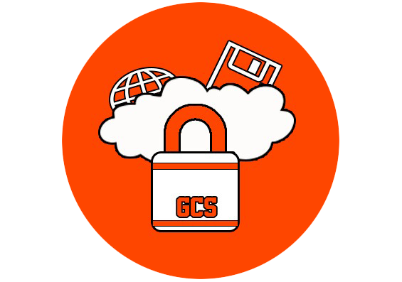

# GCS
## Garantía Completa y Segura
### V 2.0
 
____

#### Desarrolladores:
* Juan Esquivel Méndez
* Melquizedec Moo Medina
* Alejandro Sagundo Duarte

____

#### Lenguaje y versión
* Tecnología BackEnd: PHP
* Tecnología FrontEnd: HTML5, CSS3, JavaScript (JQuery)
* FrameWork: Laravel 5.6 
____

#### Dependencias Utilizadas
* Select2 (DropDowns personalizables)
* FileSelect (Botones para subir archivos personalizables)
* caouecs (MultiIdioma)
* Font Awesome (icofonts)

____

#### Sitios de Interés
* [http://kubo79.com](http://kubo79.com)
* [Canal de YouTube de jesquivel](https://www.youtube.com/channel/UCitb-PiqOi8MbHYbpzftarQ)
* [Blog de jesquivel](http://jesquivelm.blogspot.com)